# Personal Loan Success Analysis

> Identifying key factors that determine personal loan application success to improve approval rates and reduce risk.

## Problem

A personal loan company needs to understand what drives successful loan applications. Currently, approval decisions lack clear data-driven insights, leading to potential missed opportunities and unclear risk factors.

**Goal**: Build an interpretable model to identify which applicant and loan characteristics predict success.

## Solution

- **Model**: Logistic Regression (interpretable for business stakeholders)
- **Accuracy**: XX%
- **Key Findings**: 
  - Employment status is the strongest predictor
  - 4-year loan terms show higher success rates
  - Credit history (payment discipline, defaults, recent credit inquiries) significantly impacts approval

## Impact

- **Product**: Prioritise features that matter most (employment verification, loan term flexibility)
- **Marketing**: Target employed applicants with 4-year term products
- **Risk**: Quantify how credit history factors affect success probability

## Flow

```mermaid
graph TD
    %% Node Definitions
    Start[(Data Loading)] --> Schema[Schema Review & Understanding]
    Schema --> Transform[Data Transformation]
    
    %% The Cleaning Loop
    Transform --> EDA[EDA + Visualisation]
    EDA -- "Data-Cleaning Loop" --> Transform
    
    %% Transition to Modeling
    EDA --> Ready[Clean Table + Inference Ready]
    
    %% Modeling Phase Subgraph
    subgraph Modeling_Phase [Modeling Phase]
        direction LR
        Assump[Model's Assumption Transformation] --> Run[Running the Model]
        Run --> Interp[Interpretation]
    end
    
    Ready --> Assump

    %% Styling - Dark mode friendly palette
    style Start fill:#0d6efd,stroke:#0a58ca,stroke-width:2px,color:#fff
    style Schema fill:#6c757d,stroke:#495057,color:#fff
    style Transform fill:#6c757d,stroke:#495057,color:#fff
    style EDA fill:#fd7e14,stroke:#dc6a10,color:#fff
    style Ready fill:#198754,stroke:#146c43,stroke-width:2px,color:#fff
    style Assump fill:#6f42c1,stroke:#59359a,color:#fff
    style Run fill:#6f42c1,stroke:#59359a,color:#fff
    style Interp fill:#20c997,stroke:#1aa179,stroke-width:2px,color:#000
    style Modeling_Phase fill:#1e1e1e,stroke:#3d3d3d,stroke-width:2px,stroke-dasharray:5 5
```

- `yogi_takehome-test_fintech01_senior-data-analyst.ipynb` - Main analysis
- `data/` - Raw data

## Interesting Insight

### VIF

---
Yogi Cahyono | [15 December 2025]